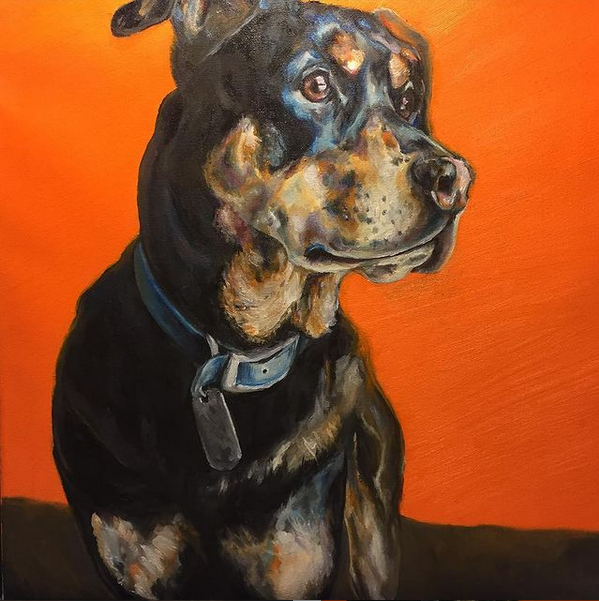
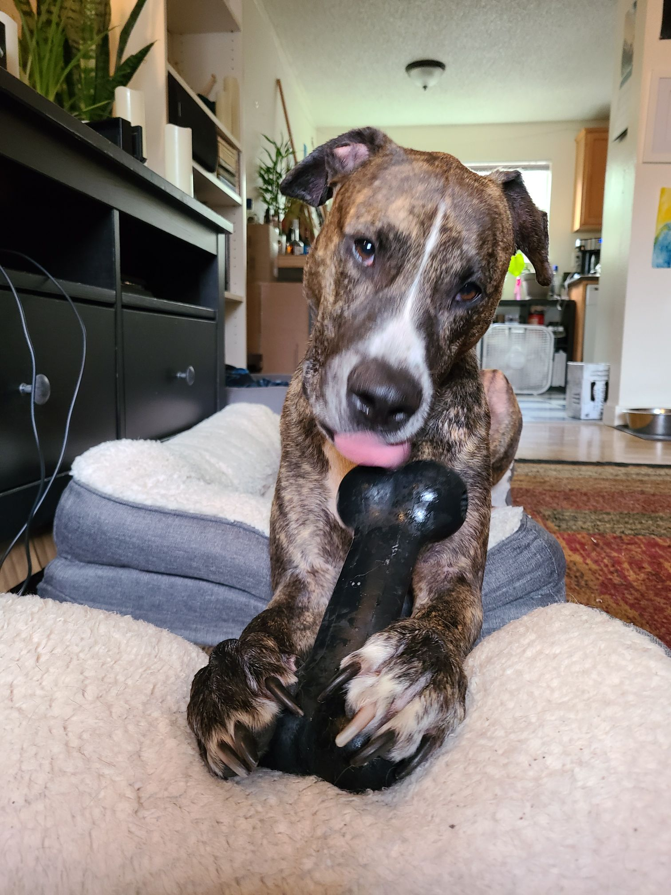
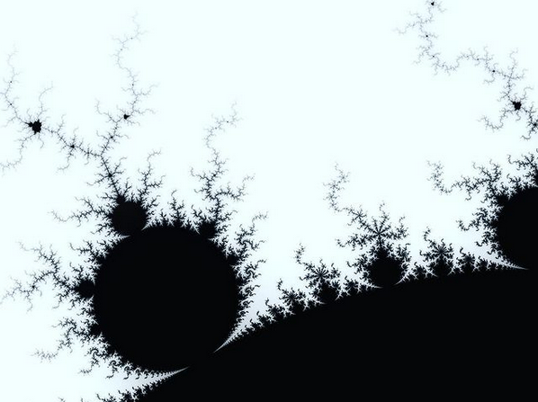
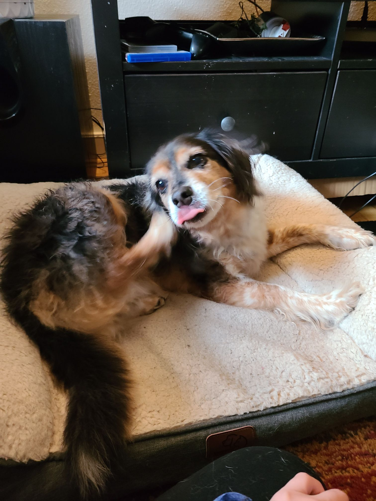
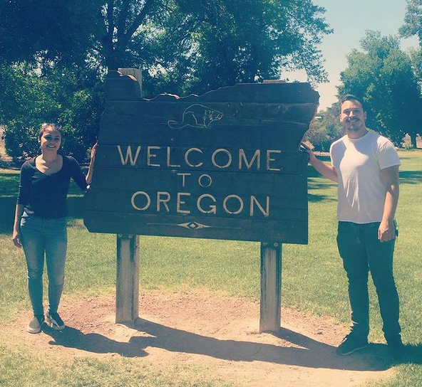
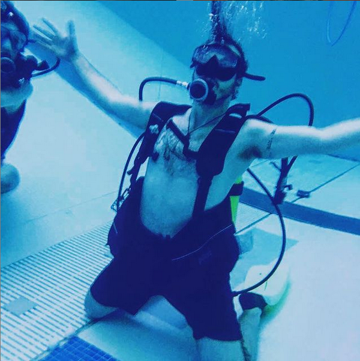

+++
title="About Me"
template="blog-page.html"
+++

##### Chapter 1

One day, I am told, I was born.
I don't remember that very well though.
Eventually I went to Ball State University for Audio Engineering
and got a Bachelor's.

##### Chapter 2

Then I moved to Chicago.
I worked in live music for a while.
Mostly it was weddings but I worked with a handful of big artists, most notably a series of rallies leading up to the Cubs 2016 world series victory.
I also painted pet portraits on the side, like this one:

##### Chapter 3

I got a dog! His name is Atlas.

##### Chapter 4

I wanted to make myself a website for the pet portrait side hustle.
On this site I wanted to provide a payment calculator so clients could
determine the price of a given size of pet portrait.
I learned some JavaScript.

> "_It made me feel powerful_"

It was all over for me.
Soon, I would be working as a Front End Developer.

##### Chapter 5

I met my partner. She also has a dog, named Ty.

##### Chapter 6

We moved to Portland, Oregon.

I did contract work in web development for a while.
I started making computer games and experimenting with other languages on the side.
I liked working in web, but I had tasted the power of programming and I knew...

> "_I had to go deeper_"

##### Chapter 7

So I got a Master's degree from Portland State University in Computer Science.
I worked on some research,
building tools for Earthquakes
and cutting-edge Server Security.
I took some classes.
I learned some pretty neat stuff.

##### Chapter 8

Tune in next time to find out...

