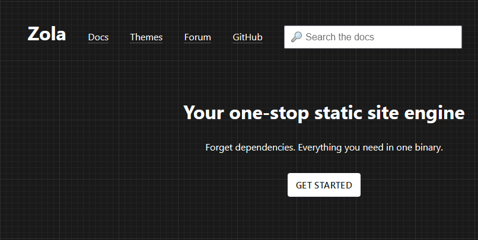

+++
title = "Zola: My New Favorite"
date = 2021-09-07
[extra]
lead = "One Static Site Generator to Rule Them All"
+++

There are a lot of static site generators out there. And most of them are pretty
good choices. Before I settled on using Zola, I built out very small sites in
several of these frameworks, including Hugo, Gatsby, NextJS.

You already know I settled on Zola, which is a fantastic choice.
It is, in my opinion, more flexible and yet simpler than the alternatives.
I have a couple of things I would like to see added, but my experience with it
so far has been great.

<!-- more -->

Zola has a pretty unassuming website:



No logo, no fancy front end stuff, just a solid site with the stuff you need in
(mostly) easy to find places. (More on that later)

It has the standards you'd expect - Markdown content with some front-matter
(in this case within a TOML `+++` block)
that renders out to template pages.

## The Good

### Flexible Structure Based on Files

Zola doesn't care if you're making a blog or something else entirely.
It generates pages based off of any files or folders in the `content` directory.
For example, in the source for this site, the file
that will become this page is at `/content/blog/why_zola.md`.
The template I'm using for the page is specified in `/content/blog/_index.md` as the
`page-template` field.

```bash
# /content/blog/_index.md

+++
title = "Blog"
sort_by = "date"
template = "blog.html"
page_template = "blog-page.html"
+++

...
```

I didn't have to do anything to get my desired blog post behavior, it's all
just built-in to work in a flexible way.
(For pages where a custom order is desired, you can sort by a "weight" field
which you can set from within markdown files.)

But -- even better -- the Projects page and it's corresponding content pages are
set up _exactly_ the same way.

### Easy Internal Links

### Anchors (Like This One)

If you're on desktop right now, you can see the table of contents on the left.
This was marked up with minimal effort by the following code snippet, lifted
from Zola's docs.

```html

<ul class="toc">
  
  <li>
    <a href="{{ h1.permalink | safe }}">{{ h1.title }}</a>
    
    <ul>
      
      <li>
        <a href="{{ h2.permalink | safe }}"> {{ h2.title }} </a>
      </li>
      
    </ul>
    
  </li>
  
</ul>

```

### Simple composable templates

### Easy Image Processing At Build Time

### Sass (SCSS)

Sass is the best approach to writing CSS. It utilizes everything that's good
(and there is good) about native CSS, while adding another layer of organization.
I don't write much of the Python-style Sass language, but the more CSS-looking
SCSS is fantastic. And SCSS just works in Zola, just include it in your html as
CSS.

## The Not So Good

### No line numbers

There's no line numbers in code rendering. No problem, I thought, inspecting
the rendered output and seeing a bunch of `<span>` tags.
I thought, [_I know exactly what to do_](https://css-tricks.com/):
[Line counting CSS.](https://css-tricks.com/almanac/properties/c/counter-increment/)

```scss
pre span {
  counter-increment: line;
  &:before {
    content: counter(line);
    color: white;
  }
}
```

But, to my abject _horror_, it came out looking like this instead:


It turns out the codeblocks are styled with `<span>`s corresponding to syntax tokens, but
there is no semantic markup for line breaks.

If each line had a `<span>` or `<div>` or even table row of its own,
this sort of trick would work,
incrementing a counter for each consecutive matching element on the page.
This is a _great_ trick, too, because those line numbers are not user-selectable.

This means in order to get nice line numbers I would have to parse the output
with JavaScript running on the client's machine.
That's fine, but kind of counter-intuitive to the point of generating it statically
and sending it completely formed.

At the time of this writing, the [ThreeJS](https://threejs.org/) homepage is the _only_ JavaScript on
this site, and I sort of considered it a challenge to keep it that way.

> Busted -- The mobile nav has a little bit of JavaScript, progressively enhanced.

If you see line numbers on any of the real code snippets above, you know I caved.

### One Frustrating Thing About The Docs

Okay this one drove me a bit crazy. Zola supports _a ton_ of syntax highlighting
themes simply from setting them in the config file. **That's great**.

What's not great is if you go on their documentation and go to the "Syntax Highlighting"
section there isn't a list of supported themes. There is a list of supported _languages_
(good!) but the corresponding list of themes is absent.

No list comes up if you google "zola syntax highlighting support themes" or any
variation of that I tried either.
There is, in fact, a list of themes in the Zola documentation, though.
On the "Configuration" page, towards the bottom.

In Zola's defense, it does make some sense here.
You do set it in the config file.
I did know this, it's why I eventually checked that page.
The way I see it there are three great and easy solutions, and I would be happy with any of them.

1. Leave syntax highlighting list where it is, link to it directly from the Syntax Highlighting page
2. Move the list to the syntax highlighting page.
3. Make it so the same list shows up in both places.

All good solutions.

### The Name

Zola is great as a name aesthetically, I have no issues with it.
Search the web for "zola" though.


Not exactly the Zola I wanted.
Zola.com is some kind of wedding business.
I don't know what they do exactly, but they have a big internet presence.
Mild inconvenience at best.

## The Point

I like this site.
I've been very happy with the process of developing it so far,
and so I like Zola too.
If you're building a new site, and it benefits from the good stuff above and
you aren't too bothered by any of the drawbacks I mentioned, check it out.

I don't think you'll regret it.
