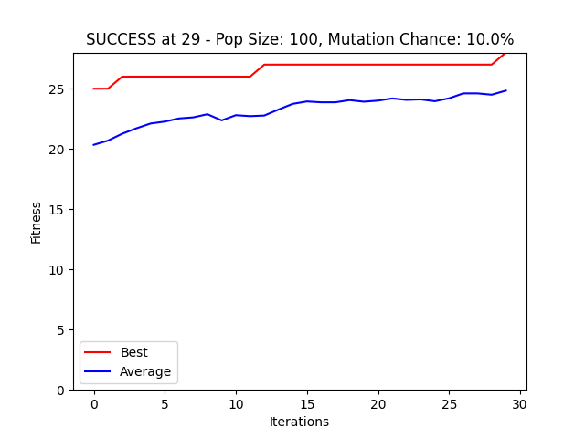

+++
title="8 Queens"
date="2021-02-21"
weight=40
[taxonomies]
language=["Python"]
[extra]
lead="A solution using a genetic algorithm"
githublink="https://github.com/Tattomoosa/8-queens"
+++

This is a genetic algorithm that finds a winning solution to the "8 queens"
problem.
This problem entails placing 8 queens on a chess board such that if any were to
move, they couldn't capture any of the others.
This implementation is in Python with no dependencies.

Completed as part of CS 541: Artificial Intelligence at Portland State University.
It doesn't perform as well as I'd hoped,
but it was one of the higher performing implementations from the class.

It was definitely an interesting project.
The code was straightforward but I was surprised how long it took to find good
values for the various modifiable parameters.
