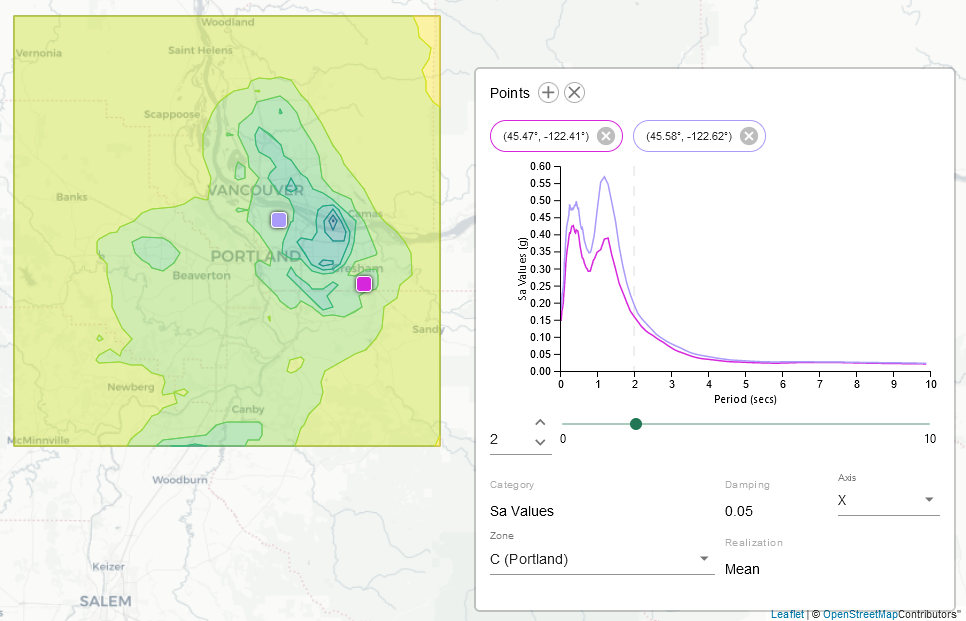

+++
title = "CSZ@PDX"
weight = 10
date = 2022-01-30
[taxonomies]
language=["React", "TypeScript", "Python", "Web Workers", "SciPy", "MatLab"]
[extra]
lead="Civil Engineering tools to study \"The Big One\""
start_date = 2018-06-01
+++

The [CSZ@PDX](https://m9csz.cee.pdx.edu/m9csz/) project contains two separate
data visualization applications built to enable Civil Engineers to more easily
analyze ground motions in the Cascadia Subduction Zone.
The aim is to provide information that will help researchers and engineers
enhance earthquake resiliency in the Pacific Northwest.
These applications are used by organizations including the Oregon Department of Transportation,
Oregon Military Department, and researchers at Portland State University.

## Tech

### Front End Technologies

The front-end applications are contained in a Single Page Application built with
TypeScript and React,
which queries the back-end via a REST API. It utilizes only functional components
with React hooks for state-management. Notable libraries used include:

- [Material UI](https://mui.com/) for form input controls, styling, and icons.
- [Leaflet](https://leafletjs.com/) is used for drawing and navigating the map.
- [D3](https://d3js.org/) is used for drawing the line visualizations and the map data key.
- [TurfJS](https://turfjs.org/) is used for drawing the actual map data shapes with a feature meant for topography.
  The map data shapes are rendered within a web-worker to ensure the user experience of the site stays
  snappy.

### Back End Technologies

The back-end application is written in Python using the
[Falcon](https://falcon.readthedocs.io/en/stable/)
framework, running under a
[GUnicorn](https://gunicorn.org/) server.
Large datasets are stored in `.NC` files,
which are loaded and indexed using
[xarray](http://xarray.pydata.org/en/stable/).
In some cases data is pre-processed with
[Scipy](https://www.scipy.org/)
before it's sent to the client.

The API is publicly available at the `/api` endpoint and can serve data in a
compressed format (for the front-end application)
or in common GeoJSON for analysis in external tools.

## M9 Application

[Check it out](https://m9csz.cee.pdx.edu/m9csz/)

This application is an interface for exploring and evaluating the _huge_ dataset
generated from a series of simulations performed by the University of Washington
as a part of the M9, or "Magnitude 9" project.

Much of the dataset for the M9CSZ was generated by a series of simulations
performed by researchers at the University of Washington.

Only a small subset of this data is available publicly without logging in.

## ARS Application

[Check it out](https://m9csz.cee.pdx.edu/ars/)

The ARS application started life as a separate project which existed as a tiny
web page with a form processed by PHP that called into MATLAB. This downloaded a file.
